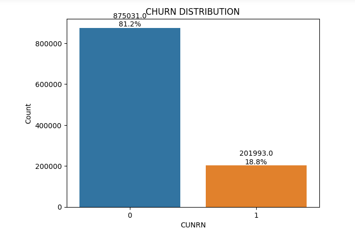
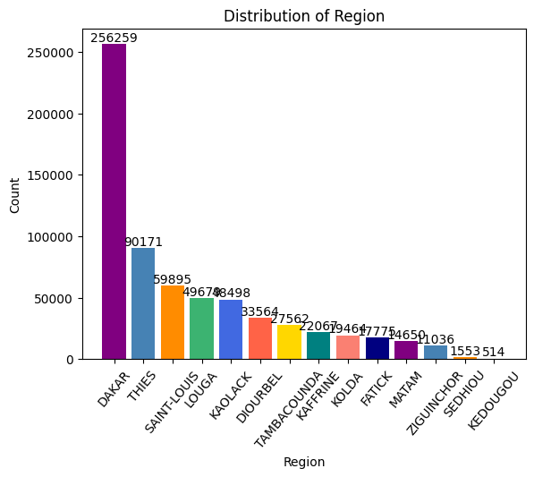
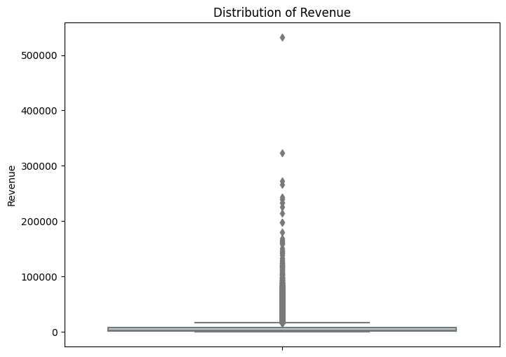
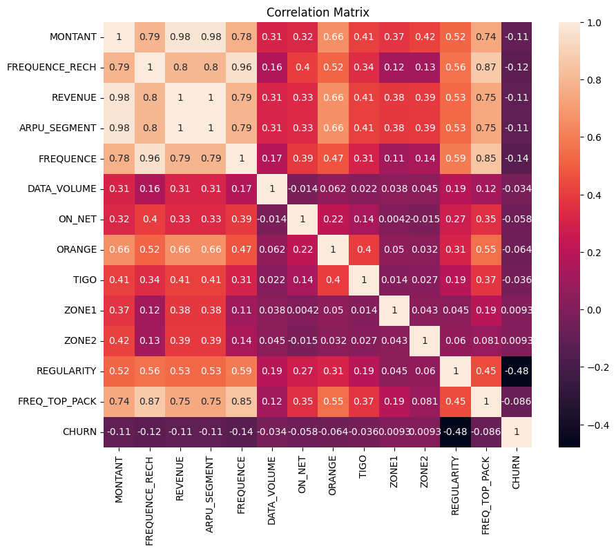
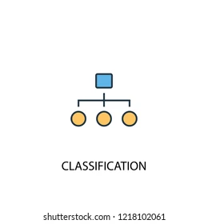
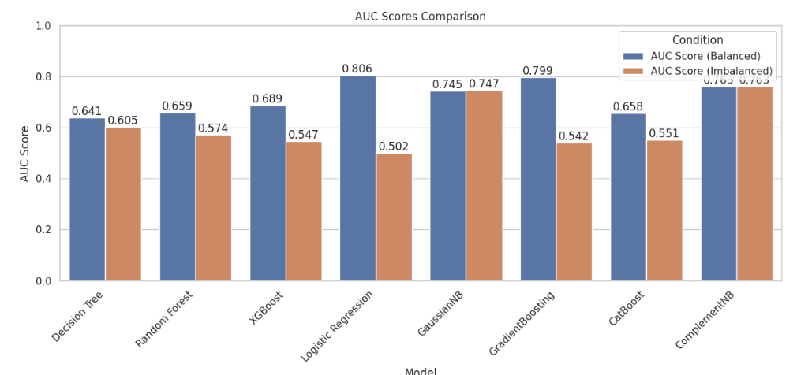
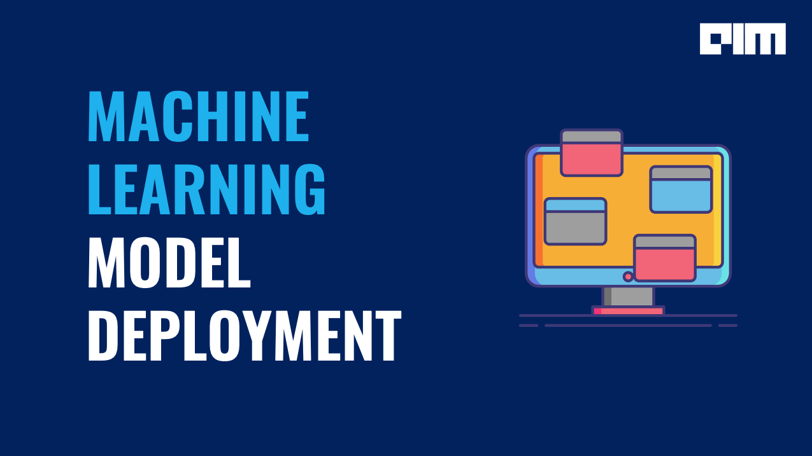
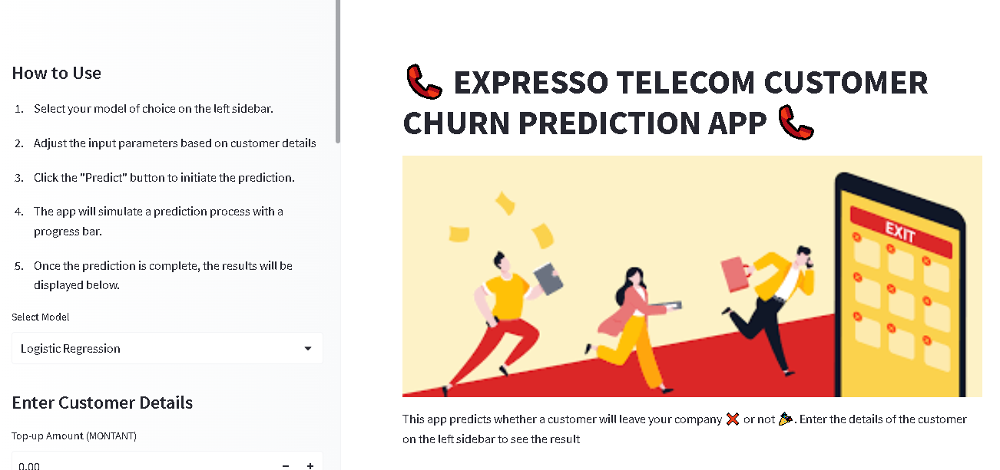
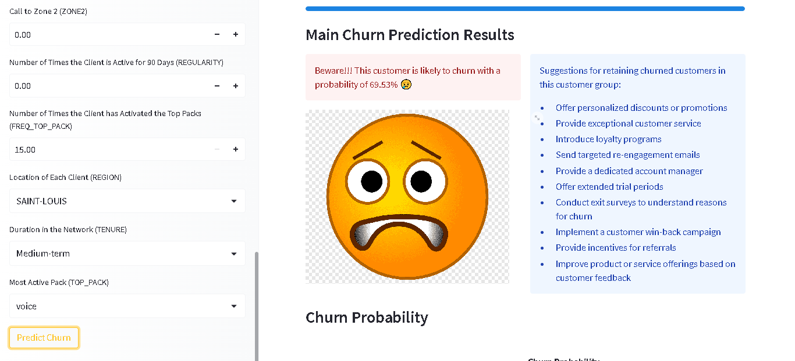

# Telecom_Churn_Classification


📞 Predicting the likelihood of customer churn is crucial for telecom companies. This repository contains code and resources for training machine learning models to classify telecom customer churn. By identifying potential churners, companies can take proactive measures to retain their valuable customers and improve customer satisfaction

## Table of Contents
[Introduction](Introduction)\
[Dataset](Dataset)\
[EDA](EDA)\
[Modeling](Modeling)\
[Evaluation](Evaluation)\
[Deployment](Deployment)\
[Set_up](Set_up)\
[Usage](Usage)\
[Contributing](contribution)

## Introduction
Customer churn refers to the phenomenon where customers of a business or service switch to another provider or discontinue using the service altogether. In the telecom industry, identifying potential churners and taking appropriate actions can significantly impact customer retention rates and business profitability.

This project provides a comprehensive solution for telecom churn classification. It involves building a machine learning model that can effectively predict whether a customer is likely to churn based on historical customer data. Additionally, it provides a user-friendly web application using Streamlit to deploy the trained model, allowing users to interactively explore predictions.

## Dataset
The dataset used for is from a telecomummincation company in Senegel,it contains a collection of features related to telecom customers. Each customer record also includes a churn label indicating whether the customer has churned or not.

🔍 The features provided in the dataset include:

**REGION**: The location of each client\
**TENURE**: Duration with the network\
**MONTANT**: Top-Up Amount\
**FREQUENCE_RECH**: the number of times a customer refilled\
**REVENUE**: Monthly income of each client\
**ARPU_SEGMENT**: income over 90 days / 3\
**FREQUENCE**: number of times the client has made an income.\
**DATA_VOLUME**: number of connections\
**ON_NET**: inter expresso call\
**ORANGE**: calls to orange\
**TIGO**: calls to tigo\
**ZONE1**: calls to zone1\
**ZONE2**: calls to zone2\
**MRG**: a client who is going\
**REGULARITY**: number of times the client is active for 90 days\
**TOP_PACK**: the most active packs\
**FREQ_TOP_PACK**: number of times the client has activated the top pack packages\
**CHURN**: variable to predict - Target

You can find the dataset in the **data** directory.

## Exploratory Data Analysis (EDA)📊 
Before building the churn prediction model, we performed exploratory data analysis (EDA) to gain insights into the dataset and understand the relationships between variables.

Some of the key EDA steps performed in this project include:


1.**Descriptive Statistics**
To gain a better understanding of the dataset, we computed descriptive statistics for the numerical. These statistics include measures such as mean, median, standard deviation, minimum, maximum, and quartiles for numerical variables.

2.**Data Visualization**
Data visualization plays a crucial role in EDA, allowing us to uncover patterns, trends, and relationships in the data. We also created various visualizations to uncover the patters and trends of the data, including:

Histograms and bar plots: To understand the distribution of numerical and categorical variables, respectively.




Box plots: To identify outliers and examine the distribution of numerical variables across different categories.



Scatter plots: To explore relationships and correlations between pairs of variables.


Heatmaps and correlation matrices: To visualize the correlation between variables and identify potential multicollinearity.



Please refer to the provided EDA notebook in the **notebooks**  folder for detailed implementation and visualizations related to the EDA process.

**Data Cleaning and Preprocessing**
Before diving into the analysis, we conducted data cleaning and preprocessing steps to ensure the dataset's quality and prepare it for analysis. This process involved:

Handling missing values: We identified missing values in the dataset and decided on the appropriate strategy to deal with them. 

Handling duplicates: We checked for and removed any duplicated records to avoid redundancy and ensure data integrity.

Data transformation: We performed necessary transformations on the data, such as converting data types, scaling numerical features, encoding categorical variables, and creating derived features.

## Modeling


In this project, multiple classification models are implemented and trained using the preprocessed telecom churn dataset. The models include:
(Logistic Regression,Random Forest,Gradient Boosting, Gaussian, Cat boost, XGBoost, ComplementNB)

First the models are trained on the imbalanced dataset to set a baseline of the model performances.From the results we observed that the models performed poorly.
To improve the models performance we applied the SMOTE technique to balance the dataset and  trained the models again on the balanced data.

Please refer to the provided capstone model notebook in the **notebooks**  folder for detailed implementation of the modeling process.

## Evaluation


The trained models are evaluated using AUC_score and log-loss. These metrics provide insights into the model's performance in predicting customer churn. The evaluation results are as shown below:



From the above observation logistics regression and Gradient Boosting models had a high AUC_score and relatively low log-loss hence saved.

## Model Deyployment


We have built a user-friendly web application for easy deployment of the churn prediction model. The web app is developed using Streamlit, a powerful Python library for creating interactive dashboards and data visualizations.

The deployment code, including the Streamlit application script, can be found in the **notebooks** directory.

## Setup
Install the required packages to be able to run the evaluation locally.

You need to have Python3 on your system. Then you can clone this repo and being at the repo's root (root :: repo_name> ...) follow the steps below:

Windows:

 ```bash
 python -m venv venv; venv\Scripts\activate; python -m pip install -q --upgrade pip; python -m pip install -qr requirements.txt 
 ``` 
Linux & MacOs:

  ```bash
  python3 -m venv venv; source venv/bin/activate; python -m pip install -q --upgrade pip; python -m pip install -qr requirements.txt
  ```  
The both long command-lines have a same structure, they pipe multiple commands using the symbol ; but you may manually execute them one after another.

1.**Create the Python's virtual environment** that isolates the required libraries of the project to avoid conflicts;

2.**Activate the Python's virtual environment** so that the Python kernel & libraries will be those of the isolated environment;

3.**Upgrade Pip, the installed libraries/packages manager** to have the up-to-date version that will work correctly;

4.**Install the required libraries/packages** listed in therequirements.txt` file so that it will be allow to import them into the python's scripts and notebooks without any issue.

NB: For MacOs users, please install Xcode if you have an issue.

## Usage
To run the Streamlit application locally, execute the following command:
```bash
streamlit run app.py
```



## Summary
| Code      | Name        | Published Article |  Deployed App |
|-----------|-------------|:-------------:|------:|
| Capstone| Telecom-Churn-Classification |[Article](https://medium.com/@peninarandu/predicting-customer-churn-in-the-telecom-industry-cc09035ff15b) |[Streamlit-app](https://huggingface.co/spaces/Pendo/Telecom-churn-prediction-app) |

## Contributions
Contributions and pull requests are welcome! If you would like to contribute to this project, please follow these steps:

1.Fork this repository.\
2.Create a new branch with a descriptive name\
3.Make your desired changes and commit them.\
4.Push the branch to your forked repository.\
5.Open a pull request in this repository and describe your changes.

Feel free to contribute to different aspects of the project, including improving the model, exploring additional features, or enhancing the EDA.

## AUTHOR 
Penina Pendo\
[](https://medium.com/@peninarandu/)

[](https://www.linkedin.com/in/penina-randu-7b004222a/)
